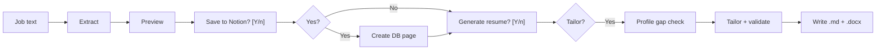

# Job tracker

A small CLI that pastes a job posting, uses an LLM to extract **position**, **company**, **industry**, **notes**, and **interview study themes**, then optionally saves a row to a **Notion** database. It can also generate an **ATS-oriented tailored resume** (Markdown + `.docx`) from your **[resume/master-profile.md](resume/master-profile.md)** and the same job description. Both Notion saving and resume generation are optional—you can skip either and still use the other.

CV quality standards and the validation rubric live in **[docs/cv-best-practices.md](docs/cv-best-practices.md)** and **[docs/cv-rubric.md](docs/cv-rubric.md)**. For manual regression checks, see **[docs/evaluation-sample-jobs.md](docs/evaluation-sample-jobs.md)**. To capture missing profile facts systematically, see **[docs/profile-data-checklist.md](docs/profile-data-checklist.md)**.

## Table of contents

- [Quick start](#quick-start)
- [Prerequisites](#prerequisites)
- [Install](#install)
- [Getting your Notion API key and database](#getting-your-notion-api-key-and-database)
- [Required database properties](#required-database-properties)
- [Configuration](#configuration)
- [Master profile (for tailored resumes)](#master-profile-for-tailored-resumes)
- [Usage](#usage)
- [Tips](#tips)
- [Troubleshooting](#troubleshooting)

## Quick start

1. **Clone** the repo and `cd` into it.
2. **Install**: `npm install` (run from the repo root so `.env.local` is found).
3. **Configure env**: `cp .env.example .env.local` and set the required keys. If you omit `LLM_PROVIDER`, the app defaults to `anthropic`; `.env.example` may show `openai` as an explicit template—either works.
4. **Notion** (optional if you only want resumes): create a database, add the [required properties](#required-database-properties), create an integration, share the database with it, and put `NOTION_API_KEY` and `NOTION_DATABASE_ID` in `.env.local`. See [Getting your Notion API key and database](#getting-your-notion-api-key-and-database).
5. **Master profile** (for tailored resumes): copy `resume/master-profile.example.md` → `resume/master-profile.md` and fill in your real history.
6. **Run**: `pbpaste | node track-job.js` (macOS clipboard) or `node track-job.js "job text here"` or `cat job.txt | node track-job.js`.

## Repository layout

| Path | Purpose |
|------|---------|
| `track-job.js` | Paste or URL → extract, score, Notion, resume + packet (manual) |
| `run-copilot.js` | **Daemon automático** — ingest, scrape, auto-packet, inbox |
| `ingest-jobs.js` | One-shot ingest (same pipeline as copilot) |
| `check-inbox.js` | Gmail → brief (+ optional Notion notes) |
| `lib/` | LLM, Notion, resume pipeline, connectors |
| `resume/` | Master profile source |
| `output/` | Generated tailored bundles |
| `docs/` | CV rubric, checklists, evaluation notes |

## Prerequisites

- **Node.js** (v18+ recommended)
- A **Notion** integration with access to your jobs database (see [Getting your Notion API key and database](#getting-your-notion-api-key-and-database) below)
- An API key for either **OpenAI** or **Anthropic**

## Install

From the **repo root**:

```bash
cd job-tracker
npm install
```

## Getting your Notion API key and database

You need two values for `.env.local`: **`NOTION_API_KEY`** (from Notion) and **`NOTION_DATABASE_ID`** (from your jobs database URL).

### 1. Create an integration and copy the API key

1. Open **[Notion → My integrations](https://www.notion.so/my-integrations)** (log in if prompted).
2. Click **\+ New integration**.
3. Choose a **name** (e.g. “Job tracker”), your **workspace**, and create it.
4. On the integration page, open the **Secrets** (or **API key**) section and **copy the “Internal Integration Secret”**.  
   - It starts with `secret_` — this is your **`NOTION_API_KEY`**.  
   - Treat it like a password; never commit it to git (`.env.local` is ignored).

Optional: under **Capabilities**, ensure the integration can **read content** and **insert content** (defaults are usually enough for creating pages in a database).

### 2. Create your jobs database in Notion

1. In Notion, create a new page and add a **Database** → **Full page** (or use an existing database).
2. Add the columns listed in [Required database properties](#required-database-properties) below — names and types must match what the script expects.

### 3. Connect the integration to that database

The API can only see pages/databases you explicitly share with the integration.

1. Open the **database as a full page** (click its title so you’re viewing the database, not a tiny inline block).
2. Use **⋯** (three dots) in the top-right → **Connections** → **Connect to** → choose your integration  
   **or** use **Share** and add your integration (wording varies slightly in Notion; look for **Connections** / **Add connections**).

If this step is skipped, saves will fail with permission or “object not found” style errors.

### 4. Copy the database ID (`NOTION_DATABASE_ID`)

1. With the database open as a full page, copy the URL from the browser bar.  
   Example shape: `https://www.notion.so/workspace-name/<DATABASE_ID>?v=...`
2. The **database ID** is the **32-character** segment in the path (letters, numbers; often shown as a UUID with hyphens — you can use it **with or without hyphens** in env vars; Notion accepts both).
3. Put that value in **`NOTION_DATABASE_ID`** in `.env.local`.

Official overview: [Notion API — Getting started](https://developers.notion.com/docs/getting-started).

## Required database properties

The script expects these properties **with these exact names and types** (names are case-sensitive):

| Property            | Type        | Notes |
|---------------------|------------|--------|
| **Position**        | Title      | Job title |
| **Company**         | Rich text  | Employer |
| **Industry**        | Select     | The model picks a short label; add options that match what you expect, or add new options in Notion as needed |
| **Application Status** | **Status** | Must include a status named **`Applied`** (or set `NOTION_STATUS_APPLIED` to match your option) |
| **Applied**         | Date       | Set to today when saved |
| **Application Link**| URL        | Job posting URL (set by ingest or `track-job --url`) |
| **Notes**           | Rich text  | Short summary from the model |
| **Study themes**    | Rich text  | Bullet list of prep topics (rename in Notion? Set `NOTION_PROPERTY_STUDY_THEMES` to match) |

### Copilot properties (add once in Notion)

| Property | Type | Notes |
|----------|------|--------|
| **Score** | Number | 0–100 from LLM scoring |
| **Match** | Select | Options: `Apply`, `Maybe`, `Skip` |
| **Source** | Select | `paste`, `greenhouse`, `lever`, `ashby` |
| **Match reasons** | Rich text | Why Apply/Maybe/Skip |
| **Packet folder** | Rich text | Local path to `output/...` after tailoring |

Extend **Application Status** with: `Discovered`, `Packet ready`, `Maybe`, `Skip`, `Interview`, `Rejected` (keep `Applied`). Ingest uses `Discovered`; copilot uses `Packet ready` when CV/cover are generated; `track-job` uses `Applied`.

## Automatización (recomendado)

Deja el copiloto corriendo sin que estés en la terminal:

```bash
npm run copilot          # daemon 24/7
npm run copilot:once     # un ciclo (cron / launchd)
```

Por defecto busca en **Himalayas + RemoteOK** (sin configurar boards). Añade `GREENHOUSE_BOARDS`, `RSS_URLS`, `SCRAPE_URLS` según necesites.

- Ofertas fuertes → Notion + carpeta en `output/` con resume y cover.
- Gmail → brief en `logs/copilot.log` y (con `COPILOT_NOTIFY=1`) notificación macOS.
- Tú solo abres Notion, filtras **Packet ready**, y envías la postulación.

Guía completa: **[docs/automation.md](docs/automation.md)** (launchd, variables, intervención mínima).

## Configuration

1. Copy the example env file and edit it:

   ```bash
   cp .env.example .env.local
   ```

2. The app loads **`.env.local`** (and overrides any keys already set in your shell).

### Required variables

| Variable | Description |
|----------|-------------|
| `NOTION_API_KEY` | Notion integration secret (`secret_...`) |
| `NOTION_DATABASE_ID` | Target database ID |
| `LLM_PROVIDER` | `openai` or `anthropic` (default: `anthropic`) |
| `OPENAI_API_KEY` | If using OpenAI |
| `ANTHROPIC_API_KEY` | If using Anthropic |

### Optional variables

| Variable | Default | Description |
|----------|---------|-------------|
| `OPENAI_MODEL` | `gpt-4o-mini` | OpenAI chat model |
| `ANTHROPIC_MODEL` | `claude-sonnet-4-20250514` | Anthropic model |
| `NOTION_PROPERTY_STUDY_THEMES` | `Study themes` | Name of the rich text property for study topics |
| `NOTION_STUDY_THEMES_MAX_TOPICS` | `12` | Max number of study theme bullets |
| `NOTION_STATUS_APPLIED` | `Applied` | Status name used on save |
| `TRACK_JOB_DEBUG` | (off) | Set to `1` to print raw JSON from the model on stderr |
| `MASTER_PROFILE_PATH` | `resume/master-profile.md` | Markdown file with your full CV facts (only source the model may use) |
| `RESUME_OUTPUT_DIR` | `output` | Base folder for per-run resume bundles |
| `GENERATE_RESUME` | `prompt` | `prompt` asks **`[Y/n]`** after Notion (Enter = yes); `1` / `yes` / `always` skips the prompt and generates; `0` / `no` / `never` skips |
| `PROFILE_GAP_CHECK` | `prompt` | Before tailoring: `prompt` asks whether to print job-vs-profile gap questions (extra LLM call); `always` / `yes` / `1` always runs; `never` / `no` / `0` skips |
| `TAILOR_RESUME_MODEL` | (same as job extraction) | Override model **name** for the resume pass only |
| `TAILOR_RESUME_MAX_TOKENS` | `8192` | Max output tokens for tailoring |
| `TAILOR_TEMPERATURE` | (unset) | Optional sampling for the **initial** tailor pass only (e.g. `0.65`); omit to use the provider default |
| `REVISE_TEMPERATURE` | (unset) | Optional sampling for the **revision** pass only; omit to use the provider default |
| `TAILOR_TOP_P` / `REVISE_TOP_P` | (unset) | Optional nucleus sampling; rarely needed if you set temperature |
| `TAILOR_JSON_MAX_RETRIES` | `2` | On invalid JSON from the model, retry the same pass up to this many **extra** attempts (parse errors only) |
| `LLM_JOB_MODEL` | (`OPENAI_MODEL` / `ANTHROPIC_MODEL`) | Override model for **job extraction** only |
| `LLM_JOB_MAX_TOKENS` | `1536` | Max tokens for job extraction |
| `RESUME_STRICT` | (off) | Set to `1` to **fail the run** if tone/grounding/relevance checks still fail after optional auto-revision |
| `RESUME_AUTO_REVISE` | `1` | Set to `0` to skip the extra LLM revision pass when validation suggests improvements |
| `MASTER_PROFILE_MIN_CHARS` | `200` | Minimum profile length for validation |

## Master profile (for tailored resumes)

1. Edit **[resume/master-profile.md](resume/master-profile.md)** with your real history, or start from **[resume/master-profile.example.md](resume/master-profile.example.md)**.
2. Use Markdown sections **`## Summary`**, **`## Experience`**, **`## Skills`**, and **`## Education`** (the script checks that at least two of these exist, that the file is not trivially short, and that **`## Experience`** has at least two substantive lines such as `### Role` entries or `-` bullets).
3. **Facts-only source of truth:** the model may only rearrange, shorten, and rephrase what you put here. Include **concrete outcomes** (metrics, scale, tech stack) *in this file* if you want them on tailored CVs—the validator compares numbers and wording to the profile.
4. Optional sections you can add for richer tailoring: **`## Projects`**, **`## Certifications`** (body text is still sent to the model as part of the profile; keep using standard `##` headings so nothing is lost in paste).
5. Add **`## Preferences`** for job scoring and cover letters (target roles, remote, salary min, dealbreakers, tone). See the example profile.
6. See **[docs/cv-best-practices.md](docs/cv-best-practices.md)** for how bullets and ATS alignment should read.

Generated files go under **`output/<date>_<company-slug>_<role-slug>/`** as **`tailored-resume.md`** and **`tailored-resume.docx`** (single-column, standard headings for ATS uploads). Body text uses **plain ASCII hyphens** (`-`) for role/company/date separators and list lines—no em dash, en dash, or Word bullet glyphs. The **DOCX header** is four lines when complete: **name**, fixed **Software Engineer**, **location** (from `contactLine`), then **email + profile links** with middle dots (no phone in the header).

## Usage

Run from the **project directory** so `.env.local` is found.

### How to pass job text

**Inline:**

```bash
node track-job.js "Senior Engineer at ExampleCo — we use TypeScript, Postgres..."
```

**From clipboard (macOS):**

```bash
pbpaste | node track-job.js
```

**From clipboard (Windows PowerShell):**

```bash
Get-Clipboard -Raw | node track-job.js
```

**From clipboard (Linux):**

```bash
xclip -selection clipboard -o | node track-job.js
# or (Wayland)
wl-paste | node track-job.js
```

**From a file:**

```bash
cat job.txt | node track-job.js
```

**From a job URL (Greenhouse / Lever / Ashby):**

```bash
node track-job.js --url "https://boards.greenhouse.io/company/jobs/123456"
```

### Batch ingest (ATS → Notion)

Set board names in `.env.local`, then:

```bash
node ingest-jobs.js
node ingest-jobs.js --board stripe
```

Review scored jobs in Notion (filter by **Match** = Apply). No duplicate URLs.

### Inbox briefs (Gmail)

1. Create a Google Cloud OAuth client (Desktop app), enable Gmail API.
2. Set `GMAIL_CLIENT_ID`, `GMAIL_CLIENT_SECRET` in `.env.local`.
3. Run `node check-inbox.js --oauth`, open the URL, authorize, then `node check-inbox.js --oauth --code YOUR_CODE`.
4. Copy `refresh_token` from `gmail-token.json` into `GMAIL_REFRESH_TOKEN` (or keep the token file).
5. Run `node check-inbox.js` or `node check-inbox.js --watch`.

Set `INBOX_APPEND_NOTION=1` to append brief summaries to matched Notion pages.

> **Interactive prompts when piping:** When job text is piped (e.g. clipboard), the script reads prompts from your terminal via `/dev/tty`. This works on **macOS and Linux**. On **native Windows** shells, piped stdin + prompts can behave differently; if prompts fail, use inline job text (`node track-job.js "..."`) or pipe from a file, or run under WSL for Unix TTY behavior.

### End-to-end flow



1. **Extract** — The script sends the text to the configured LLM and parses JSON: position, company, industry, notes, and `studyThemes` (technical interview prep topics).
2. **Preview** — It prints the extracted fields in the terminal.
3. **Save to Notion?** — Enter or **y** / **yes** = save. Answering **n** skips the Notion API; the script **still continues** to the resume prompt.
4. **Generate tailored resume?** — Unless `GENERATE_RESUME` is `always` or `never`, it asks. On **yes**, it may print **soft profile warnings** (e.g. missing `## Summary`, few metrics). If `PROFILE_GAP_CHECK` is not `never`, it can ask to run an optional **profile gap** step (one LLM call) that lists honest job-vs-profile gaps and suggested questions. That list is **read-only in the terminal** — you do not type answers there; you add anything true to `resume/master-profile.md` (or `MASTER_PROFILE_PATH`) in an editor, then choose whether to continue tailoring or stop and re-run after editing. Then it runs a tailoring LLM pass (profile + job text), prints **quality scores** (ATS, relevance, grounding, tone, clarity) and warnings, may run **one automatic revision** if `RESUME_AUTO_REVISE=1` (default) and validation suggests it, then writes **`tailored-resume.md`** and **`tailored-resume.docx`** under **`RESUME_OUTPUT_DIR`**. Severe grounding issues fail before export.

### Non-interactive resume generation

```bash
GENERATE_RESUME=1 pbpaste | node track-job.js
```

You will still get the Notion **`[Y/n]`** prompt unless you answer **n** (or **no**); set `GENERATE_RESUME=1` so resume generation runs without asking. To skip the optional profile-gap prompt as well, set **`PROFILE_GAP_CHECK=never`** (otherwise the script may still ask on your terminal via `/dev/tty`).

### Common workflows

| Goal | Approach |
|------|----------|
| **Track only** (no resume) | Run as usual; answer **n** to "Generate tailored resume?" Or set `GENERATE_RESUME=never`. |
| **Resume only** (skip Notion) | Run as usual; answer **n** to "Save to Notion?" Resume prompt still appears. |
| **Non-interactive / CI** | `GENERATE_RESUME=1 PROFILE_GAP_CHECK=never`; answer **n** to Notion if piping, or run with inline text and scripted input. |

## Tips

- **Enough text**: Very short input (&lt; ~40 characters) triggers a warning; the model needs real job description content, not empty clipboard or login-only pages.
- **Industry select**: If Notion rejects the save, the model’s industry string may not match any **Industry** select option—add that option in Notion or adjust the property.
- **Debug extraction issues**: `TRACK_JOB_DEBUG=1 node track-job.js "..."` to see the raw model output.
- **Resume debug**: same `TRACK_JOB_DEBUG=1` also prints raw JSON from the tailoring step on stderr.

## Troubleshooting

| Problem | What to try |
|---------|-------------|
| “No job description” / empty fields | Check clipboard: `pbpaste \| head -c 400` |
| “Extraction returned no usable fields” | Paste includes real job body, not only UI chrome |
| Notion API errors | Confirm integration is **shared** with the database; property names and types match the table above |
| Wrong LLM | Set `LLM_PROVIDER=openai` or `anthropic` and the matching API key |
| “Master profile validation failed” | Add real content and required `##` sections; see [Master profile](#master-profile-for-tailored-resumes) |
| Tailoring errors / empty experience | Ensure **`## Experience`** has multiple `-` bullets or `###` role blocks (see example profile) |
| `RESUME_STRICT=1` failures | Review printed scores and warnings; improve the master profile; try `RESUME_AUTO_REVISE=1` (default); or unset strict mode |
| “Resume validation failed” / blocking | Remove unsupported metrics, align wording with the profile, or shorten claims flagged as low-overlap |
| Prompts don't appear when piping (Windows) | Use inline text: `node track-job.js "job text"`, or pipe from file, or run under WSL |

## License

ISC (see `package.json`).
